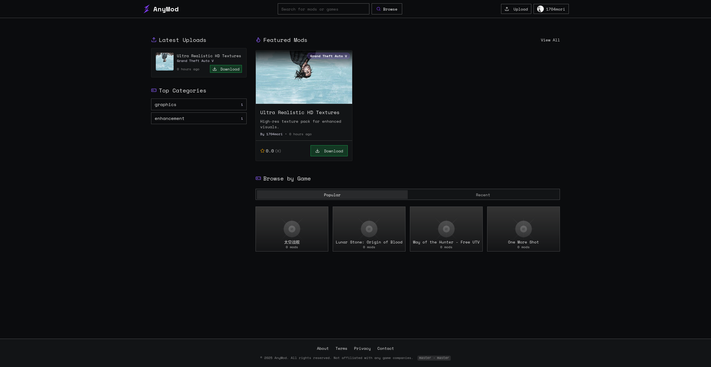
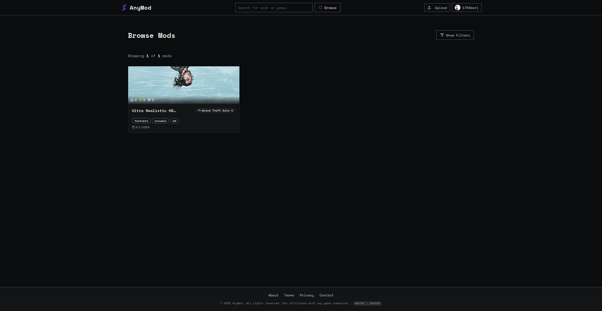
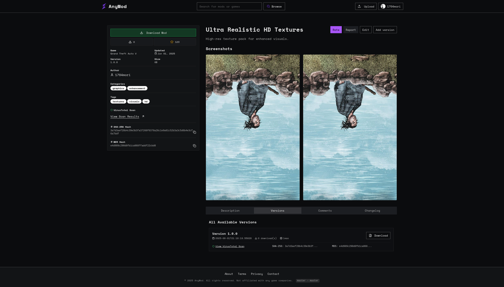
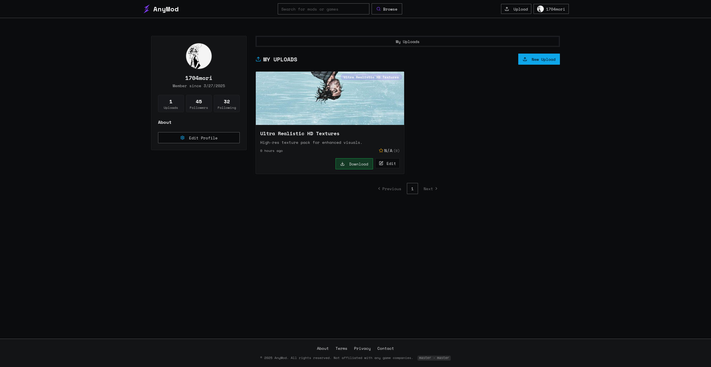

# AnyMod

**AnyMod** is a modern web application built with Svelte designed to help you discover, upload, and manage game mods. It provides a fast, user-friendly interface for searching mods and games, uploading your own creations, and managing permissions and visibility settings for your content.

## Features

- ⚡ **Fast Mod & Game Search**  
  Powered by MeiliSearch, find mods and games quickly with advanced search and filtering.

- ⬆️ **Easy Mod Uploads**  
  Upload your mods with detailed permission controls (asset ownership, redistribution, credits).

- 📝 **Rich Mod Details**  
  Each mod includes detailed information, versioning, compatibility, and download links.

- 👤 **Account & Privacy Controls**  
  Manage your account, control activity visibility, and filter content according to your preferences.

- 🔎 **Modern UI**  
  Sleek, accessible interface with Svelte and Tailwind CSS.

## 📸 Screenshots

  
Click to expand

  
  *Homepage view with search and featured mods.*

  
  *Browse mods page with search feature, grid style.*

  
  *Detailed mod page with description, versioning, and download options.*

  
  *Upload form with permission and redistribution controls.*

## License

This project is licensed under the GNU General Public License v3.0 (GLP v3).

---

**Repository:** [github.com/1704mori/anymod](https://github.com/1704mori/anymod)
